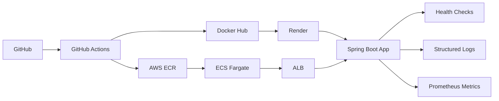

# 📚 IU CAT – Library Management System


Production-ready Spring Boot library management system with book rentals, holds/queue system, automated notifications, and multi-cloud deployment.

**Live Demos:**
- **AWS ECS Fargate:** http://iucat-alb-1688673649.us-east-1.elb.amazonaws.com
- **Render:** https://iucat-library.onrender.com

---

## 🏗️ Architecture


---

## 🚀 Quick Start
```bash
# Clone and run
git clone https://github.com/gauri2029/iucat.git
cd iucat
./mvnw spring-boot:run

# Access at http://localhost:8080
```

**Test Credentials:** `abc` / `password123`

---

## ✨ Key Features

- ✅ **Book Rentals** - 14-day loans with 2x extensions
- ✅ **Holds/Queue System** - Automatic queue management
- ✅ **Advanced Search** - AJAX filters, 100+ books
- ✅ **Health Checks** - `/actuator/health`, liveness/readiness probes
- ✅ **Structured Logging** - JSON logs with correlation IDs
- ✅ **Prometheus Metrics** - JVM, HTTP, database monitoring
- ✅ **Multi-Cloud** - AWS ECS Fargate + Render
- ✅ **CI/CD** - Automated deployment pipeline

---

## 🛠 Tech Stack

**Backend:** Java 17, Spring Boot 3.5.6, Spring Data JPA  
**Frontend:** Thymeleaf, HTML5, CSS3, JavaScript  
**Database:** H2 (prod), SQLite (dev)  
**DevOps:** Docker, GitHub Actions, AWS ECR/ECS/ALB, Render  
**Observability:** Spring Actuator, Logback JSON, MDC Correlation IDs, Prometheus

---

## ☁️ Deployments

### AWS ECS Fargate (Primary)
- **URL:** http://iucat-alb-1688673649.us-east-1.elb.amazonaws.com
- **Architecture:** Internet → ALB → ECS Service → Fargate Tasks
- **Cluster:** `iucat-cluster` | **Service:** `iucat-service`
- **Deploy:** Auto on push to `main` via GitHub Actions
- **Cost:** Free (AWS Free Tier - $100 credits)

**Manual Deploy:**
```bash
aws ecs update-service --cluster iucat-cluster --service iucat-service --force-new-deployment
```

### Render.com (Secondary)
- **URL:** https://iucat-library.onrender.com
- **Deploy:** Auto on push to `main`

---

## 🔍 Observability

### Health Checks
```bash
curl http://iucat-alb-1688673649.us-east-1.elb.amazonaws.com/actuator/health
curl http://iucat-alb-1688673649.us-east-1.elb.amazonaws.com/actuator/health/liveness
curl http://iucat-alb-1688673649.us-east-1.elb.amazonaws.com/actuator/health/readiness
```

### Correlation IDs
```bash
curl -H "X-Correlation-ID: test-123" http://iucat-alb-1688673649.us-east-1.elb.amazonaws.com/search
# Check logs for correlationId=test-123
```

### Prometheus Metrics
```bash
curl http://iucat-alb-1688673649.us-east-1.elb.amazonaws.com/actuator/prometheus
```

---

## 📊 Load Test Results

**Test:** 10 concurrent users, 2 minutes, 660 requests

| Metric | Result | Status |
|--------|--------|--------|
| Success Rate | 100% | ✅ |
| Avg Response | 75ms | ✅ |
| P95 Response | 109ms | ✅ |
| Max Response | 278ms | ✅ |
| Requests/sec | 5.37 | ✅ |

**Run Test:**
```bash
brew install k6
k6 run load-test.js
```

---

## 🔄 CI/CD Pipeline

**Workflow:** Build → Test → Docker Build → Deploy

1. **Build & Test** - Maven compile + JUnit tests
2. **Docker (Render)** - Push to Docker Hub
3. **Docker (AWS)** - Push to ECR
4. **Deploy Render** - Webhook trigger
5. **Deploy ECS** - Force new deployment with latest image

**View:** [GitHub Actions](https://github.com/gauri2029/iucat/actions)

---

## 🗄 Database Schema
```sql
users (id, username, password, role)
books (id, isbn, title, author, available_copies, total_copies, publication_year, language, format, subject)
rentals (id, user_id, book_id, rental_date, due_date, return_date, status, extension_count, extension_limit)
holds (id, user_id, book_id, hold_date, expiration_date, status, queue_position)
```

---

## 🔗 API Endpoints

### Core
- `POST /login` - Authenticate
- `GET /search?query={q}` - Search books
- `GET /books/{id}` - Book details

### Rentals
- `GET /my-rentals` - List rentals
- `POST /rent/{id}` - Rent book
- `POST /extend/{id}` - Extend due date
- `POST /return/{id}` - Return book

### Holds
- `GET /my-holds` - List holds
- `POST /holds/place/{id}` - Place hold
- `POST /holds/pickup/{id}` - Pickup ready hold

### Monitoring
- `GET /actuator/health` - Health status
- `GET /actuator/health/liveness` - Liveness probe
- `GET /actuator/health/readiness` - Readiness probe
- `GET /actuator/prometheus` - Prometheus metrics

---

## 🧪 Testing
```bash
# Unit tests
./mvnw test

# Load test
k6 run load-test.js

# Docker
docker build -t iucat-library .
docker run -p 8080:8080 iucat-library
```

**Test Flows:**
1. Login → Search → Rent → Extend (2x) → Return
2. Rent all copies → Place hold → Return → Hold becomes ready → Pickup
3. Search with filters → Verify AJAX updates

---

## 📦 Project Structure
```
├── .github/workflows/ci-cd.yml    # CI/CD pipeline
├── src/main/
│   ├── java/.../config/
│   │   └── CorrelationIdFilter.java
│   ├── resources/
│   │   ├── application-aws.properties
│   │   └── logback-spring.xml
├── Dockerfile
├── load-test.js
└── pom.xml
```
---

## 🔗 Links

- **Repo:** [github.com/gauri2029/iucat](https://github.com/gauri2029/iucat)
- **Live (AWS):** http://iucat-alb-1688673649.us-east-1.elb.amazonaws.com
- **Live (Render):** https://iucat-library.onrender.com
- **Pipeline:** [GitHub Actions](https://github.com/gauri2029/iucat/actions)

---
