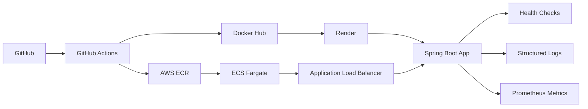

<div align="center">

# 📚 IUCAT Library Management System

### Search, borrow, hold, and manage books through a complete full-stack library workflow

[](https://github.com/gauri2029/iucat/actions)


[🌐 **Try the Live App**](https://iucat-library.onrender.com)
&nbsp;•&nbsp;
[🛠️ **Setup Guide**](docs/SETUP.md)
&nbsp;•&nbsp;
[⚙️ **CI/CD Pipeline**](https://github.com/gauri2029/iucat/actions)

</div>

---

## ✨ What is IUCAT?

IUCAT is a full-stack library management application built with **Java, Spring Boot, Thymeleaf, JavaScript, and Docker**.

Users can search the catalog, borrow books, extend rentals, join hold queues, and track their activity through complete end-to-end workflows. The project also includes automated CI/CD, cloud deployment, health checks, structured logging, correlation IDs, Prometheus metrics, and baseline load testing.

> **Demo account:** `abc` / `password123`  
> Seeded for evaluation purposes only. No real user data is stored.

## 🌐 Live Demo

The Render deployment is fully interactive. Sign in with the demo account and try the search, rental, extension, return, and hold-queue workflows.

### **[Open IUCAT and explore the application →](https://iucat-library.onrender.com)**

<!-- Optional visual preview:
Add a GIF to docs/images/iucat-demo.gif and uncomment the line below.

-->

---

## 🚀 Core Features

| Feature | What it supports |
|---|---|
| 🔎 **Book Discovery** | Search and filter a catalog of 100+ books with AJAX-powered updates |
| 📖 **Rentals** | Borrow books for 14 days, extend eligible rentals, and return items |
| ⏳ **Hold Queues** | Join queues when copies are unavailable and process ready-for-pickup holds |
| 👤 **User Workflows** | View current rentals, due dates, extensions, and active holds |
| 🛡️ **Role-Based Access** | Protected workflows for authenticated users |
| ❤️ **Health Monitoring** | Liveness, readiness, and application health endpoints |
| 🔭 **Observability** | Structured JSON logs, correlation IDs, and Prometheus metrics |
| 🚢 **Automated Delivery** | Build, test, containerize, and deploy through GitHub Actions |

---

## 🧑‍💻 Engineering Highlights

- Designed relational workflows for **users, books, rentals, extensions, returns, and hold queues**
- Built server-rendered interfaces with **Thymeleaf, HTML, CSS, JavaScript, and AJAX**
- Added request tracing through **MDC correlation IDs** and structured JSON logging
- Exposed **Spring Actuator** health checks and Prometheus-compatible metrics
- Automated Maven builds, tests, Docker image publishing, and cloud deployment
- Validated critical user journeys through unit testing and k6 baseline load testing
- Deployed the application to **Render** and implemented an **AWS ECS Fargate + ALB** deployment architecture

---

## 🏗️ Architecture


```mermaid
graph LR
    A[GitHub] --> B[GitHub Actions]
    B --> C[Docker Hub]
    B --> D[AWS ECR]
    C --> E[Render]
    D --> F[ECS Fargate]
    E --> G[Spring Boot App]
    F --> H[Application Load Balancer]
    H --> G
    G --> I[Health Checks]
    G --> J[Structured Logs]
    G --> K[Prometheus Metrics]
```

### Cloud status

- ✅ **Render:** Active and available as the public live demo
- 💤 **AWS ECS Fargate:** Deployment architecture was completed and validated, but the running services are currently paused to avoid ongoing infrastructure costs

---

## 🛠️ Tech Stack

### Application


- **Backend:** Java 17, Spring Boot 3.5.6, Spring MVC, Spring Data JPA
- **Frontend:** Thymeleaf, HTML5, CSS3, JavaScript, AJAX
- **Database:** H2 for the deployed profile, SQLite for local development

### Delivery & Observability


- **DevOps:** Docker, GitHub Actions, Docker Hub, AWS ECR, ECS Fargate, ALB, Render
- **Observability:** Spring Actuator, Prometheus metrics, Logback JSON, MDC correlation IDs
- **Testing:** JUnit, Maven, k6

---

## ⚡ Quick Start

```bash
git clone https://github.com/gauri2029/iucat.git
cd iucat
./mvnw spring-boot:run
```

Open:

```text
http://localhost:8080
```

For environment details, Docker commands, testing, observability, and troubleshooting, see the complete **[Setup & Usage Guide](docs/SETUP.md)**.

---

## 📊 Baseline Load Test

**Scenario:** 10 concurrent users for 2 minutes, generating 660 requests.

| Metric | Result |
|---|---:|
| Success rate | 100% |
| Average response time | 75 ms |
| P95 response time | 109 ms |
| Maximum response time | 278 ms |
| Throughput | 5.37 requests/sec |

Run the included test:

```bash
k6 run load-test.js
```

> These results represent a controlled baseline test and are not intended as a large-scale production benchmark.

---

## 🔄 CI/CD Pipeline

```text
Build → Test → Docker Build → Publish Image → Deploy
```

The GitHub Actions workflow:

1. Builds the application with Maven
2. Runs the automated test suite
3. Builds Docker images
4. Publishes images to Docker Hub and AWS ECR
5. Triggers the Render deployment
6. Supports ECS service deployment using the latest image

### **[View workflow runs →](https://github.com/gauri2029/iucat/actions)**

---

## 🔍 Observability

The application exposes:

- `/actuator/health`
- `/actuator/health/liveness`
- `/actuator/health/readiness`
- `/actuator/prometheus`

Requests can include an `X-Correlation-ID` header for traceable structured logs.

More examples are included in the **[Setup & Usage Guide](docs/SETUP.md#observability)**.

---

## 🧪 Key Test Flows

1. Login → Search → Rent → Extend → Return
2. Rent all available copies → Join hold queue → Return a copy → Process ready hold
3. Search with filters → Verify AJAX updates
4. Verify health, readiness, liveness, and metrics endpoints
5. Build and run the application through Docker

---

## 🗂️ Repository Structure

```text
├── .github/workflows/ci-cd.yml
├── docs/
│   └── SETUP.md
├── src/main/
│   ├── java/
│   └── resources/
├── Dockerfile
├── load-test.js
├── pom.xml
└── README.md
```

---

## 🔗 Project Links

- 🌐 [Live Application](https://iucat-library.onrender.com)
- 🛠️ [Setup & Usage Guide](docs/SETUP.md)
- ⚙️ [GitHub Actions](https://github.com/gauri2029/iucat/actions)
- 📦 [Repository](https://github.com/gauri2029/iucat)

---

<div align="center">

### Built to explore complete application workflows - from UI and business logic to CI/CD and cloud deployment. ✨

</div>
